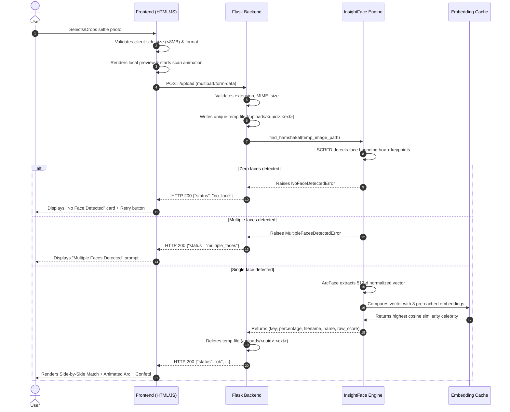
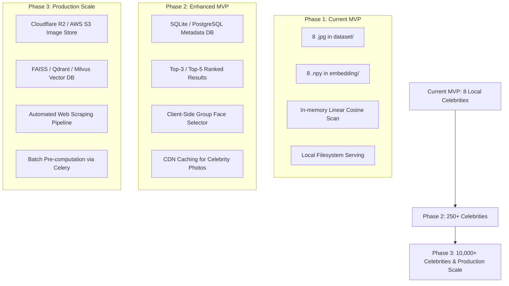

# Project Requirements Document (PRD): Hamshakal Finder

**Document Version:** 1.0.0  
**Project:** Hamshakal Finder (Celebrity Lookalike AI)  
**Status:** Approved MVP Specification  
**Author:** AI/ML Systems Architect & Technical Documentation Lead  

---

## 1. Project Overview

### 1.1 What is Hamshakal Finder?
**Hamshakal Finder** (*"Hamshakal"* meaning *"lookalike"* or *"doppelgänger"* in Hindi/Urdu) is an artificial intelligence web application that analyzes a photograph of a user's face, extracts high-dimensional geometric facial feature representations (embeddings), and compares them against a curated gallery of celebrity facial embeddings to find and display the closest celebrity lookalike.

### 1.2 What Problem Does It Solve?
Comparing faces visually by hand is subjective, inaccurate, and tedious. People naturally wonder which well-known personality or celebrity they resemble most. Traditional online lookalike applications often suffer from one of three problems:
1. They use non-AI heuristics (e.g. random results or trivial color matching).
2. They upload and retain personal user photographs on external servers without clear privacy policies.
3. They rely on heavy, bloated deep-learning backends that cost significant money to host and frequently crash due to memory exhaustion.

Hamshakal Finder solves this by providing a privacy-first, scientifically backed, and lightweight lookalike matching application utilizing deep facial representation networks (InsightFace ArcFace) running efficiently on low-resource CPU infrastructure.

### 1.3 Purpose of the MVP
The purpose of the Minimum Viable Product (MVP) is to validate the end-to-end user experience and algorithmic pipeline:
* Enable a user to upload a selfie photo.
* Execute automated face detection and feature extraction in sub-second latency.
* Perform fast vector similarity matching against a baseline collection of 8 Bollywood celebrities.
* Return the single highest-scoring celebrity match with an intuitive similarity score and matching image.
* Operate reliably within constrained compute environments (e.g., cloud free-tier hosting with $\le$ 512 MB RAM).

---

## 2. Problem Statement

Users desire an entertaining, instant, and frictionless way to discover which celebrity they look like, but they expect fast responses, immediate visual feedback, and guarantees that their personal photos are not permanently stored on third-party servers.

From an engineering perspective, deploying deep learning computer vision models typically requires high-cost GPU infrastructure and gigabytes of memory. The challenge is delivering state-of-the-art deep facial recognition accuracy (ArcFace) in an ultra-compact, cost-free, CPU-friendly package that handles diverse real-world images gracefully without crashing or running out of memory.

---

## 3. Project Objectives

### 3.1 Current MVP Objectives (Verified & Implemented)
* **Single-Face Matching:** Accurately detect a single face in an uploaded image and find the closest celebrity match from the local gallery.
* **Deterministic, State-of-the-Art ML:** Use InsightFace's SCRFD detector and ArcFace ResNet-50 recognition model to produce 512-dimensional embeddings.
* **High Efficiency & Low Resource Consumption:** Keep total server memory consumption strictly below 400 MB RAM during peak CPU inference, enabling deployment on free cloud hosting (e.g., Render Free Tier, Hugging Face Spaces).
* **Sub-Second Inference:** Reduce CPU inference latency to under 1.0 second per image.
* **Privacy by Design:** Automatically clean up uploaded user images from the server filesystem immediately after processing.
* **Resilient Error Handling:** Gracefully handle edge cases (no face detected, multiple faces detected, corrupt files) and return structured JSON errors without terminating the server process.

### 3.2 Future Objectives (Post-MVP Roadmap)
* **Dataset Expansion:** Scale the celebrity gallery from 8 to 500+ celebrities across global film, sports, and entertainment industries.
* **Vector Indexing (ANN):** Migrate from in-memory linear cosine search to Approximate Nearest Neighbor (ANN) search using libraries like FAISS or HNSW as the gallery grows beyond 10,000 faces.
* **Decoupled Cloud Storage:** Store celebrity target images and user-uploaded assets in S3-compatible cloud object storage (e.g., Cloudflare R2, AWS S3) rather than local container filesystems.
* **Multi-Face Interactive Selection:** Allow users uploading group photos to tap and select which specific face they wish to analyze.
* **Top-K Roster (Top-3 / Top-5 Matches):** Provide a secondary screen showing runners-up alongside the primary #1 match.

---

## 4. Target Users and Use Cases

### 4.1 Target Audience
1. **Casual Web Users & Entertainment Seekers:** Individuals looking for fun, viral social media content comparing their appearance to famous personalities.
2. **AI & ML Enthusiasts / Students:** Developers seeking an open-source, well-documented reference implementation of deep face recognition deployed on resource-constrained platforms.
3. **Event & Marketing Organizers:** Kiosk or photo-booth operators seeking a self-contained lookalike matching demonstration.

### 4.2 Primary Use Cases
* **UC-1: Individual Lookalike Search:** A user visits the website on mobile or desktop, uploads a portrait selfie, watches a 2-second scan animation, and receives their top celebrity match with a similarity score and celebratory confetti.
* **UC-2: Result Sharing & Download:** The user clicks "Download Result Card" to save a synthetic comparison image or uses "Share" to copy a pre-formatted message to their clipboard for social media.
* **UC-3: Error Correction & Guidance:** A user uploads a picture of a pet or landscape; the system politely notifies them that no human face was detected and prompts them to upload a well-lit solo portrait.

---

## 5. Functional Requirements

### FR-1: Image Upload
* **FR-1.1:** The system shall accept image uploads via an HTTP `POST` request to `/upload` using `multipart/form-data` with the form field key `image`.
* **FR-1.2:** The frontend shall support drag-and-drop file upload, file browsing via dialog, and pasting where supported.
* **FR-1.3:** The maximum permitted file upload size shall be capped at 8 MB (configured via `MAX_CONTENT_LENGTH`).

### FR-2: File Validation
* **FR-2.1:** The backend shall validate file extensions against an allowlist: `.jpg`, `.jpeg`, `.png`, `.webp`.
* **FR-2.2:** The backend shall inspect the incoming MIME type (`image/jpeg`, `image/png`, `image/webp`).
* **FR-2.3:** Requests with missing files, empty filenames, or unapproved formats shall be rejected with HTTP 400 and an informative JSON error message (`status: "invalid_image"`).

### FR-3: Face Detection
* **FR-3.1:** The backend shall decode the uploaded image using OpenCV and pass the image tensor to the SCRFD face detector.
* **FR-3.2:** If **zero faces** are detected, the backend shall return an HTTP 200 response with `{"status": "no_face", "error": "No face detected in the image."}`.
* **FR-3.3:** If **more than one face** is detected, the backend shall return an HTTP 200 response with `{"status": "multiple_faces", "error": "Multiple faces detected. Please upload an image with exactly one face."}`.

### FR-4: Face Embedding Extraction
* **FR-4.1:** For the single detected face, the system shall align the face using 5 facial keypoints (eyes, nose, mouth corners) and generate a 512-dimensional normalized float32 embedding vector using ArcFace ResNet-50.
* **FR-4.2:** The embedding pipeline must use the exact model configuration (`buffalo_l` ArcFace) that generated the pre-computed celebrity embeddings.

### FR-5: Celebrity Lookalike Matching
* **FR-5.1:** The backend shall load all pre-computed celebrity embeddings into an in-memory cache once during application startup.
* **FR-5.2:** The system shall compute the cosine similarity between the user's embedding vector $\mathbf{u}$ and each celebrity vector $\mathbf{c}_i \in \mathcal{C}$:
  $$\text{Sim}(\mathbf{u}, \mathbf{c}_i) = \frac{\mathbf{u} \cdot \mathbf{c}_i}{\|\mathbf{u}\|_2 \|\mathbf{c}_i\|_2}$$
* **FR-5.3:** The candidate celebrity with the highest similarity value shall be selected as the best match.

### FR-6: Similarity Score Generation
* **FR-6.1:** The raw similarity score $\in [-1.0, 1.0]$ shall be clamped to $[0.0, 1.0]$ and multiplied by 100 to yield a percentage score formatted to two decimal places:
  $$\text{Percentage} = \text{round}(\max(0.0, \text{Sim}) \times 100, 2)$$
* **FR-6.2:** The response payload shall explicitly designate the calculation type as `score_type: "cosine_similarity"`.

### FR-7: Result Display
* **FR-7.1:** The response shall return JSON containing:
  - `status`: `"ok"`
  - `celebrity_key`: Lowercase identifier (e.g., `"alia"`)
  - `celebrity_name`: Formatted display name (e.g., `"Alia Bhatt"`)
  - `celebrity_image_url`: Relative path to reference photo (e.g., `"/dataset/alia.jpg"`)
  - `user_image_url`: Temporary preview path
  - `match_percentage`: Float (e.g., `94.25`)
  - `similarity_score`: Float (e.g., `0.9425`)
* **FR-7.2:** The frontend shall display the user's uploaded image alongside the matching celebrity image, animate a circular percentage gauge, and trigger a celebratory confetti animation for matches exceeding 95%.

### FR-8: Automatic Cleanup & Privacy
* **FR-8.1:** Any temporary image written to the server's disk during request processing shall be deleted unconditionally in a `finally` block before completing the request cycle.
* **FR-8.2:** The application shall not persist biometric embeddings to any database.

---

## 6. Complete User Flow

---

## 7. MVP Features: Current vs Out-of-Scope vs Future

| Feature | Current MVP Status | Implementation Details |
| :--- | :--- | :--- |
| **Single Face Lookalike Matching** | **IMPLEMENTED** | Detects 1 face, matches against 8 Bollywood celebrity embeddings. |
| **In-Memory Embedding Caching** | **IMPLEMENTED** | Embeddings loaded into Python dict at startup; zero disk I/O per request. |
| **Process-Level Model Singleton** | **IMPLEMENTED** | InsightFace loaded once at startup; reused across all incoming requests. |
| **Automatic Temp File Deletion** | **IMPLEMENTED** | Guaranteed cleanup in `try...finally` block; zero permanent storage. |
| **Unified or Decoupled Hosting** | **IMPLEMENTED** | Flask serves static frontend at `/` or supports separate Vercel frontend via CORS. |
| **Healthcheck Liveness Probe** | **IMPLEMENTED** | `GET /health` returns JSON status and number of indexed celebrities. |
| **Top-1 Closest Celebrity Match** | **IMPLEMENTED** | Focuses strictly on closest match as per MVP specification. |
| **Top-5 Celebrity Leaderboard** | *OUT OF SCOPE (MVP)* | Planned for Phase 2 once dataset exceeds 50 celebrities. |
| **Interactive Face Bounding Box Selector** | *OUT OF SCOPE (MVP)* | Requires client-side canvas cropping tool for group photos. |
| **User Authentication / Accounts** | *OUT OF SCOPE* | Unnecessary for MVP; introduces unwanted data liability. |
| **External Vector Database (FAISS/Milvus)**| *FUTURE SCOPE* | Warranted when celebrity gallery exceeds 5,000 embeddings. |
| **Cloud Object Storage (S3 / R2)** | *FUTURE SCOPE* | Planned when celebrity image dataset grows beyond container storage limits. |

---

## 8. Non-Functional Requirements

### 8.1 Performance & Latency
* **Cold Start Model Initialization:** $\le 3.0$ seconds on modern single-core CPU.
* **Per-Request Inference Latency:** $\le 1.0$ second on modern single-core CPU (Measured average: **0.58 seconds**).
* **Network Payload:** Response JSON payload $\le 1$ KB.

### 8.2 Memory & Hardware Constraints
* **Peak Working Set RAM:** Must not exceed **400 MB** under active inference (Measured: **368 MB**), ensuring safe operation inside 512 MB free-tier cloud containers without triggering cgroup OOM termination.
* **Compute Architecture:** 100% CPU-executable (`CPUExecutionProvider`). No GPU or CUDA hardware requirements.

### 8.3 Reliability & Maintainability
* **Process Stability:** Zero use of `exit()`, `sys.exit()`, or unhandled fatal exceptions. Worker processes must remain active indefinitely.
* **Cross-Platform Path Anchoring:** All filesystem operations must resolve relative to `Path(__file__).resolve().parent.parent` to prevent working-directory crashes.
* **Filesystem Case-Insensitivity Fallback:** Serving reference images must handle Linux case-sensitivity discrepancies cleanly.

### 8.4 Security & Privacy
* **Path Traversal Protection:** User uploads must never be saved under raw user-supplied filenames. Filenames must be generated via `uuid.uuid4().hex` and sanitized using `werkzeug.utils.secure_filename`.
* **Zero Long-Term Biometric Retention:** The server must not log, store, or transmit biometric feature vectors.
* **CORS Protection:** Configurable CORS middleware permitting authorized frontend origins.

---

## 9. User Interface Requirements

The user interface must deliver a polished, modern, responsive experience:
* **Visual Theme:** Sleek dark-mode aesthetic with ambient background glows, grid overlays, and subtle glassmorphic containers.
* **Typography:** Modern Google Fonts pairing: **Space Grotesk** for prominent titles, **Inter** for clean body text, and **JetBrains Mono** for numerical readouts.
* **Upload Zone:** High-visibility dashed drag-and-drop region with interactive hover states, file type labels (`JPG, PNG, WEBP`), and clear button prompts.
* **Scan Animation:** During inference, display a pulsing scanning line over the preview image along with an animated radial percentage spinner and cycling status messages (*"Detecting facial features..."*, *"Generating embeddings..."*, *"Finding your Hamshakal..."*).
* **Result Presentation Card:**
  - Side-by-side presentation of user upload and celebrity photo.
  - Formatted celebrity full name (e.g. *"Shah Rukh Khan"*).
  - Prominent circular animated percentage ring indicating similarity score.
  - Explanatory subtitle clarifying that the metric represents mathematical cosine similarity.
  - Confetti burst animation for high-confidence matches ($\ge 95\%$).
* **Action Buttons:**
  - *"Try Another Photo"* (resets upload state without page reload).
  - *"Download Result Card"* (renders dynamic summary onto an HTML5 canvas and triggers `.png` download).
  - *"Share Result"* (triggers native Web Share API or copies formatted message to clipboard).
* **Error States:** Dedicated, friendly error cards with distinct SVG warning icons and contextual guidance (e.g., advising better lighting or solo portrait).

---

## 10. Acceptance Criteria

| ID | Test Scenario | Expected Outcome | Verification Method |
| :--- | :--- | :--- | :--- |
| **AC-1** | Upload valid photo matching indexed celebrity (e.g. `akshay.jpg`). | Returns HTTP 200, `status: "ok"`, `celebrity_name: "Akshay Kumar"`, `match_percentage: 100.0%`. | Automated test suite (`test_suite.py:test_04`) |
| **AC-2** | Upload image containing no human face (e.g. blank canvas or object). | Returns HTTP 200, `status: "no_face"`. UI shows "No Face Detected" card. Server process remains running. | Automated test suite (`test_suite.py:test_05, test_11`) |
| **AC-3** | Upload image containing two or more distinct faces. | Returns HTTP 200, `status: "multiple_faces"`. UI informs user to upload a solo photo. | Automated test suite (`test_suite.py:test_06`) |
| **AC-4** | Upload non-image file (e.g. `.txt`, `.pdf`) or corrupt file. | Returns HTTP 400, `status: "invalid_image"`. UI displays warning toast. | Automated test suite (`test_suite.py:test_07, test_12`) |
| **AC-5** | Query `/health` endpoint. | Returns HTTP 200, `{"status": "healthy", "celebrities_indexed": 8}`. | Automated test suite (`test_suite.py:test_08`) |
| **AC-6** | Case sensitivity test (`/dataset/anushka.jpg` vs `/dataset/Anushka.jpg`). | Both URLs return HTTP 200 image data on Linux/Windows. | Automated test suite (`test_suite.py:test_13`) |
| **AC-7** | Verify temporary file cleanup. | `uploads/` folder item count before and after request remains identical. | Automated test suite (`test_suite.py:test_14`) |
| **AC-8** | Peak memory verification during CPU inference. | Resident Set Size (RSS) must remain below 400 MB. | Memory profiler benchmark |

---

## 11. Future Scope and Evolution

---

## 12. Known Limitations and Disclaimers

1. **Similarity Score is Not Genetic or Identity Verification:** The returned percentage reflects the cosine distance between two 512-dimensional neural activation vectors generated by ArcFace. It is an algorithmic visual similarity metric, not a biological resemblance percentage or legal identity verification.
2. **Small Candidate Gallery:** With 8 indexed celebrities in the MVP, the system will always match the user against the closest person among those 8, even if the absolute visual resemblance is low.
3. **Lighting, Pose, and Occlusion Sensitivity:** Faces angled more than 45 degrees away from the camera, heavy motion blur, dark shadows, or sunglasses can reduce detection confidence below the 0.5 threshold.
4. **Demographic Representation:** Deep face recognition models reflect the distribution of their training datasets (e.g. Glint360k, MS1MV2). Performance may vary across diverse lighting conditions, skin tones, age groups, and facial accessories.
