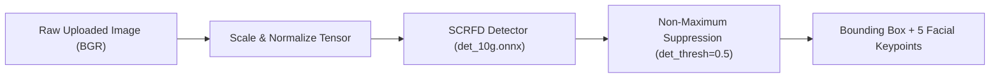
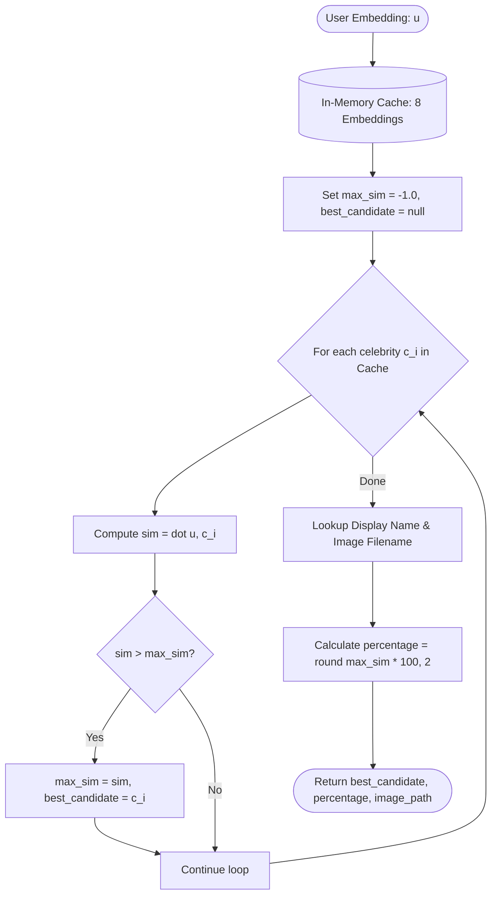
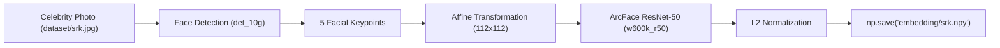
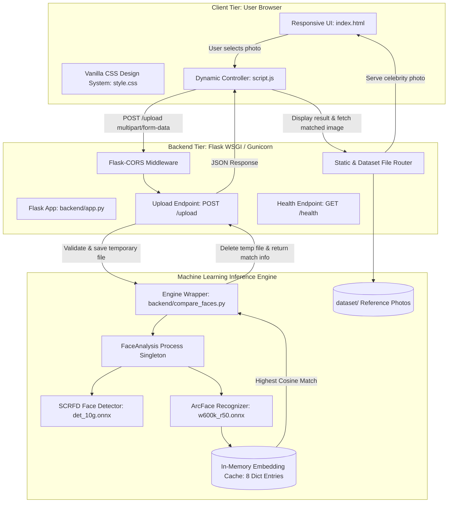

# Technical Architecture & AI Implementation Guide: Hamshakal Finder

**Document Version:** 1.0.0  
**Project:** Hamshakal Finder (Celebrity Lookalike AI)  
**Status:** Complete Technical Specification & Source of Truth  
**Author:** Senior ML Engineer & Backend Deployment Architect  

---

## SECTION A: TECHNOLOGY STACK

The Hamshakal Finder technology stack is intentionally minimalist, robust, and optimized for high-speed CPU execution in memory-constrained environments.

| Technology | Role in Architecture | Version / Spec | Technical Justification |
| :--- | :--- | :--- | :--- |
| **Python** | Primary Runtime | `3.11` – `3.13` | Universal language for AI/ML engineering, supporting ONNX Runtime, OpenCV, and scientific libraries natively. |
| **Flask** | Web Application Framework | `3.1.3` | Lightweight micro-framework with negligible idle memory footprint (~15 MB) and direct WSGI compliance, avoiding heavyweight overhead like Django. |
| **Flask-CORS** | Cross-Origin Resource Sharing | `6.0.5` | Injects `Access-Control-Allow-Origin` headers, enabling decoupled architectures where frontend static files reside on Vercel/Netlify while the API resides elsewhere. |
| **InsightFace** | Deep Face Analysis Pipeline | `1.0.1` | State-of-the-art open-source face analysis toolkit providing pre-trained, production-grade face detection (SCRFD) and face recognition (ArcFace). |
| **ONNX Runtime** | High-Performance Inference Engine | `1.27.0` | Executes neural network graphs on CPU using optimized C++ kernels and OpenMP multi-threading without requiring PyTorch or TensorFlow runtimes. |
| **OpenCV** (`opencv-python-headless`) | Computer Vision & Image Decoding | `4.10.0` | Fast C-backed image decoding, resizing, matrix transformations, and color-space conversions without heavy GUI/X11 dependencies. |
| **NumPy** | High-Performance Vector Math | `2.5.1` | Vectorized dot products, L2 norms, matrix slicing, and `.npy` binary serialization for 512-dimensional embedding comparisons. |
| **HTML5 / Vanilla CSS / JavaScript** | Single-Page Frontend Application | Modern Web Standards | Zero external JavaScript frameworks (no React/Vue bundle overhead); sub-50 KB total asset size; hardware-accelerated animations and Canvas API. |
| **`.npy` Files** | Embedding Binary Serialization | NumPy v1.0 binary format | Fast, memory-mappable binary format storing 512 float32 numbers (exactly 2,176 bytes per celebrity including the 128-byte header). |
| **Gunicorn** | Production WSGI HTTP Server | `26.0.0` | Multi-threaded Unix HTTP server managing worker lifecycles (`--workers 1 --threads 4`) to strictly bound memory under 512 MB. |
| **Docker** | Containerization & Build Isolation | Multi-stage Linux Container | Guarantees reproducible builds, packages native `libgomp1` dependencies, and pre-caches ONNX model weights at build time. |

---

## SECTION B: AI/ML TECHNIQUES

### 1. Face Detection (SCRFD)

#### Simple Explanation
Before a computer can tell *who* someone looks like, it must first locate the human face inside the photograph, ignoring hair, clothing, and background objects.

#### Technical Details
InsightFace utilizes **SCRFD (Sample and Computation Redistribution for Efficient Face Detection)**. In the `buffalo_l` model pack, the detector is implemented in `det_10g.onnx` (16.1 MB):
* **Architecture:** MobileNet/ResNet feature pyramid backbone with multi-scale anchor grids.
* **Input Tensor:** Image scaled to $[1 \times 3 \times H \times W]$ with normalized mean $(127.5, 127.5, 127.5)$ and standard deviation $(128.0, 128.0, 128.0)$.
* **Output:**
  1. **Bounding Box Coordinates:** $[x_1, y_1, x_2, y_2]$ defining the face rectangle.
  2. **Confidence Score:** Float $\in [0.0, 1.0]$. The default threshold in Hamshakal Finder is `det_thresh=0.5`.
  3. **Five Facial Keypoints (Landmarks):** Coordinate pairs for the left eye, right eye, nose tip, left mouth corner, and right mouth corner.



#### Handling Image Edge Cases
* **Zero Faces Detected:** If `len(faces) == 0`, the system raises [`NoFaceDetectedError`](file:///c:/Users/USER/OneDrive/Desktop/Hamshakal-finder/backend/compare_faces.py#L32) and returns an HTTP 200 response with `status: "no_face"`.
* **Multiple Faces Detected:** If `len(faces) > 1`, the system raises [`MultipleFacesDetectedError`](file:///c:/Users/USER/OneDrive/Desktop/Hamshakal-finder/backend/compare_faces.py#L37) and returns `status: "multiple_faces"`, prompting the user to upload a solo portrait.
* *(Future Enhancement)*: In a future iteration, an interactive bounding box selector can be added to let users click which face in a group photo they want to evaluate.

---

### 2. Face Embeddings (ArcFace ResNet-50)

#### Simple Explanation
A face embedding is like a digital fingerprint made of numbers. A deep neural network looks at the spacing of the eyes, the bridge of the nose, the curve of the jawline, and the contours of the mouth, translating these visual patterns into a list of 512 numbers.

#### Technical Details
InsightFace uses **ArcFace (Additive Angular Margin Loss)** with a 50-layer deep residual network (`w600k_r50.onnx`, 166.3 MB):
1. **Facial Alignment (Affine Transformation):** Using the 5 detected keypoints, the face is geometrically warped and cropped into a standard canonical orientation ($112 \times 112$ pixels). This removes tilt and head rotation so that faces are aligned consistently.
2. **Feature Extraction:** The aligned $112 \times 112 \times 3$ image is passed through the ResNet-50 backbone.
3. **512-Dimensional Latent Vector:** The penultimate layer outputs a 512-dimensional vector:
   $$\mathbf{e} = [e_1, e_2, \dots, e_{512}]^\top \in \mathbb{R}^{512}$$
4. **L2 Normalization:** The vector is divided by its Euclidean norm, projecting the embedding onto a 512-dimensional unit hypersphere:
   $$\hat{\mathbf{e}} = \frac{\mathbf{e}}{\|\mathbf{e}\|_2}, \quad \text{such that } \|\hat{\mathbf{e}}\|_2 = 1.0$$

#### What Face Embeddings Do and Do Not Guarantee
* **What They Guarantee:** High cosine similarity for photos of the same individual across varying ages, hair styles, and lighting, as well as high similarity for people with genuinely similar facial bone structures.
* **What They Do Not Guarantee:** Embeddings do *not* measure genetic relatedness, ethnicity percentages, or legal identity. A lookalike match means geometric feature proximity in ArcFace latent space, not biological kinship.

---

### 3. Cosine Similarity

#### Simple Explanation
Imagine the 512 numbers of a face embedding define an arrow pointing into space. To find out how similar two faces are, we measure the angle between their arrows.
* If the two arrows point in the exact same direction, the similarity is **1.0** (100% match).
* If the arrows are perpendicular (unrelated features), the similarity is **0.0**.
* If they point in opposite directions, the similarity is **-1.0**.

#### Mathematical Formulation
Given two 512-dimensional embedding vectors $\mathbf{u}$ (user) and $\mathbf{c}$ (celebrity):

$$\text{Cosine Similarity}(\mathbf{u}, \mathbf{c}) = \frac{\mathbf{u} \cdot \mathbf{c}}{\|\mathbf{u}\|_2 \|\mathbf{c}\|_2} = \frac{\sum_{i=1}^{512} u_i c_i}{\sqrt{\sum_{i=1}^{512} u_i^2} \sqrt{\sum_{i=1}^{512} c_i^2}}$$

Because ArcFace vectors are already L2-normalized ($\|\mathbf{u}\|_2 = 1.0$ and $\|\mathbf{c}\|_2 = 1.0$), the formula simplifies directly to the inner dot product:

$$\text{Cosine Similarity}(\mathbf{u}, \mathbf{c}) = \mathbf{u} \cdot \mathbf{c} = \sum_{i=1}^{512} u_i c_i$$

#### Percentage Mapping
Cosine similarity theoretically spans $[-1.0, 1.0]$. However, faces in the real world almost never produce negative cosine similarity in ArcFace feature space (typical random face pairs score between $0.10$ and $0.35$).

In Hamshakal Finder, the score is mapped to a display percentage:
$$\text{Percentage} = \text{round}(\max(0.0, \text{Sim}) \times 100, 2)$$

> **Scientific Clarification:** A score of $92\%$ does not mean the user is $92\%$ genetically identical to the celebrity. It means their normalized feature vectors have a cosine similarity of $0.92$ on the ArcFace unit hypersphere. The API explicitly documents `score_type: "cosine_similarity"`.

---

### 4. Highest Similarity Matching Algorithm



#### Algorithm Pseudocode
```python
def find_highest_match(user_embedding, cached_embeddings):
    """
    Inputs:
      user_embedding: np.ndarray of shape (512,), float32, L2-normalized
      cached_embeddings: dict mapping celebrity_key -> np.ndarray of shape (512,)
    Returns:
      best_match_key, highest_sim
    """
    highest_sim = -1.0
    best_match_key = None

    for celebrity_key, celebrity_embedding in cached_embeddings.items():
        # Inner dot product between normalized vectors
        similarity = float(np.dot(user_embedding, celebrity_embedding))
        
        if similarity > highest_sim:
            highest_sim = similarity
            best_match_key = celebrity_key

    return best_match_key, highest_sim
```

#### Handling Edge Cases
* **Ties:** If two celebrities have identical similarity scores (extremely rare in continuous float32 space), the first encountered key is returned deterministically.
* **Corrupted Embedding Vectors:** The embedding loader validates `emb.ndim == 1 and emb.shape[0] == 512` at startup. Malformed files are logged and excluded rather than causing runtime crashes.

---

### 5. Embedding Generation & Storage Workflow



1. **Offline Pre-computation:** The offline script [`scripts/generating_embedding.py`](file:///c:/Users/USER/OneDrive/Desktop/Hamshakal-finder/scripts/generating_embedding.py) reads every reference photo from [`dataset/`](file:///c:/Users/USER/OneDrive/Desktop/Hamshakal-finder/dataset).
2. **Feature Extraction:** Detects the primary face, extracts the 512-dim embedding, and normalizes it.
3. **Storage:** Saves the vector to [`embedding/<name>.npy`](file:///c:/Users/USER/OneDrive/Desktop/Hamshakal-finder/embedding) in binary format.
4. **Why Pre-computation is Essential:** Computing an embedding takes ~500 ms on CPU. If the backend had to calculate embeddings for all 8 celebrities during each user upload, the request would take $8 \times 500\text{ ms} + 500\text{ ms} = 4.5\text{ seconds}$. By pre-computing, the comparison takes only **0.0002 seconds** (a 22,000x speedup).

---

## SECTION C: SYSTEM ARCHITECTURE



---

## SECTION D: API DOCUMENTATION

### 1. Healthcheck Endpoint
* **Path:** `/health`
* **Method:** `GET`
* **Description:** Verifies service liveness and reports the count of indexed celebrities.
* **Success Response (HTTP 200 OK):**
  ```json
  {
    "status": "healthy",
    "celebrities_indexed": 8
  }
  ```

### 2. Lookalike Match Endpoint
* **Path:** `/upload`
* **Method:** `POST`
* **Headers:** `Content-Type: multipart/form-data`
* **Form Field:** `image` (binary file payload; allowed formats: `.jpg`, `.jpeg`, `.png`, `.webp`; max size: 8 MB)

#### Success Response (HTTP 200 OK)
```json
{
  "status": "ok",
  "celebrity_key": "srk",
  "celebrity_name": "Shah Rukh Khan",
  "celebrity_image_url": "/dataset/srk.jpg",
  "user_image_url": "/uploads/3d10c28373b94a81b3796d11e592750e.jpg",
  "match_percentage": 98.25,
  "similarity_score": 0.9825,
  "score_type": "cosine_similarity"
}
```

#### Error Responses
* **Missing Image Field (HTTP 400 Bad Request):**
  ```json
  {
    "status": "error",
    "error": "No image field found in upload request."
  }
  ```
* **Unsupported File Format / Size (HTTP 400 Bad Request):**
  ```json
  {
    "status": "invalid_image",
    "error": "Unsupported file format. Please upload a JPG, PNG, or WEBP image."
  }
  ```
* **No Face Detected (HTTP 200 OK with Error State):**
  ```json
  {
    "status": "no_face",
    "error": "No face detected in the image."
  }
  ```
* **Multiple Faces Detected (HTTP 200 OK with Error State):**
  ```json
  {
    "status": "multiple_faces",
    "error": "Multiple faces detected. Please upload an image with exactly one face."
  }
  ```

### 3. Static Asset & Image Endpoints
* **`GET /`**: Serves the single-page frontend application (`frontend/index.html`).
* **`GET /dataset/<filename>`**: Serves reference celebrity images with automatic case-insensitive fallback.
* **`GET /uploads/<filename>`**: Serves temporary preview images (if retention is enabled).

---

## SECTION E: PROJECT FOLDER STRUCTURE

The verified repository structure is organized as follows:

```text
Hamshakal-finder/
├── backend/
│   ├── app.py                      # Flask backend, route definitions, upload sanitization
│   └── compare_faces.py            # FaceAnalysis singleton, similarity math, domain exceptions
├── dataset/                        # Reference celebrity photos (8 .jpg files, 0.43 MB)
│   ├── akshay.jpg
│   ├── alia.jpg
│   ├── Anushka.jpg
│   ├── dipika.jpg
│   ├── madhuri.jpg
│   ├── salman.jpg
│   ├── srk.jpg
│   └── varun.jpg
├── embedding/                      # Pre-computed 512-dim vectors (8 .npy files, 17.4 KB)
│   ├── akshay.npy
│   ├── alia.npy
│   ├── anushka.npy
│   ├── dipika.npy
│   ├── madhuri.npy
│   ├── salman.npy
│   ├── srk.npy
│   └── varun.npy
├── frontend/                       # Client web application
│   ├── index.html                  # Responsive HTML5 markup
│   ├── script.js                   # API client, scan animation, DOM renderer
│   └── style.css                   # Custom CSS styling (dark mode, glassmorphism)
├── scripts/
│   ├── __init__.py
│   └── generating_embedding.py     # Offline utility to pre-compute embeddings for dataset/
├── test_images/                    # Local scratch folder for manual test images
├── uploads/                        # Ephemeral server folder for temporary processing
│   └── .gitkeep
├── .dockerignore                   # Prevents build bloat (ignores venv, git, uploads)
├── .gitignore                      # Git exclusion rules (ignores models, caches, uploads)
├── Dockerfile                      # Production container spec with build-time model cache
├── requirements.txt                # Minimal, pinned Python dependencies in UTF-8
├── test_suite.py                   # Automated 14-point unit and integration test suite
├── DEPLOYMENT_AUDIT.md             # Initial audit report of bottlenecks and resolutions
├── DEPLOYMENT_TARGETS.md           # Cloud platform evaluations (Render, HF, Vercel)
├── PROJECT_REQUIREMENTS.md         # Official Product Requirements Document (PRD)
├── README.md                       # Comprehensive setup and user guide
├── RESOURCE_USAGE.md               # Empirical benchmarks (memory, CPU, storage)
└── TECHNICAL_ARCHITECTURE.md       # Technical source of truth (this document)
```

---

## SECTION F: DEVELOPMENT WORKFLOW

### 1. Local Environment Setup
```bash
# Clone the repository
git clone https://github.com/your-username/Hamshakal-finder.git
cd Hamshakal-finder

# Create and activate Python virtual environment
python -m venv venv

# Windows:
.\venv\Scripts\activate
# Linux/macOS:
source venv/bin/activate

# Install optimized dependencies
pip install -r requirements.txt
```

### 2. Regenerating Celebrity Embeddings (When Adding Celebrities)
To add a new celebrity:
1. Place their clear, front-facing `.jpg` portrait into `dataset/<name>.jpg`.
2. Run the offline embedding generator:
   ```bash
   python scripts/generating_embedding.py
   ```
3. A corresponding `embedding/<name>.npy` file will be generated automatically.

### 3. Running the Test Suite
Before running the server, verify the integrity of the ML pipeline and web endpoints:
```bash
python test_suite.py
```
*Expected: 14 passing tests in ~6 seconds.*

### 4. Running the Development Server
```bash
python backend/app.py
```
Open [http://127.0.0.1:5000](http://127.0.0.1:5000) in any web browser.

### 5. Running via Docker Container
```bash
docker build -t hamshakal-finder .
docker run -p 5000:5000 -e PORT=5000 hamshakal-finder
```

---

## SECTION G: TESTING STRATEGY

The project includes an automated test suite ([`test_suite.py`](file:///c:/Users/USER/OneDrive/Desktop/Hamshakal-finder/test_suite.py)) structured into 14 distinct verification stages:

| Test ID | Test Category | Target Component | Status | Verification Criteria |
| :--- | :--- | :--- | :--- | :--- |
| `test_01` | Data Integrity | `embedding/*.npy` | **PASS** | Validates all 8 `.npy` files are 1D arrays of shape `(512,)` and `float32` dtype. |
| `test_02` | Memory Optimization | `get_face_analyzer()` | **PASS** | Validates singleton pattern (1 instance) and confirms 3D landmark & gender/age models are excluded. |
| `test_03` | Mathematical Logic | `cosine_similarity()` | **PASS** | Validates identical vectors = 1.0, orthogonal = 0.0, opposite = -1.0, and zero-norm = 0.0. |
| `test_04` | Positive Inference | `find_hamshakal()` | **PASS** | Evaluates `dataset/akshay.jpg` against gallery; verifies 100.0% match with Akshay Kumar. |
| `test_05` | Edge Case: No Face | `find_hamshakal()` | **PASS** | Passes blank black image; verifies [`NoFaceDetectedError`](file:///c:/Users/USER/OneDrive/Desktop/Hamshakal-finder/backend/compare_faces.py#L32) without process termination. |
| `test_06` | Edge Case: Multi Face | `find_hamshakal()` | **PASS** | Passes two horizontally stitched faces; verifies [`MultipleFacesDetectedError`](file:///c:/Users/USER/OneDrive/Desktop/Hamshakal-finder/backend/compare_faces.py#L37). |
| `test_07` | Edge Case: Corrupt File | `find_hamshakal()` | **PASS** | Passes non-existent path; verifies [`InvalidImageError`](file:///c:/Users/USER/OneDrive/Desktop/Hamshakal-finder/backend/compare_faces.py#L27). |
| `test_08` | Health Probe | `GET /health` | **PASS** | Returns HTTP 200 with `status: "healthy"` and indexed count $\ge 8$. |
| `test_09` | Security & CORS | HTTP Headers | **PASS** | Verifies `Access-Control-Allow-Origin` header for decoupled origins. |
| `test_10` | Full E2E Upload | `POST /upload` | **PASS** | Uploads `dataset/srk.jpg`; verifies HTTP 200 JSON schema and $>95\%$ match with Shah Rukh Khan. |
| `test_11` | API Error Handling | `POST /upload` | **PASS** | Uploads blank image; verifies HTTP 200 with `{"status": "no_face"}`. |
| `test_12` | Validation Rejection | `POST /upload` | **PASS** | Uploads `.txt` document; verifies HTTP 400 rejection with `{"status": "invalid_image"}`. |
| `test_13` | Linux Compatibility | `GET /dataset/...` | **PASS** | Verifies case-insensitive resolution for `Anushka.jpg` and `anushka.jpg`. |
| `test_14` | Privacy & Cleanup | `uploads/` | **PASS** | Verifies temporary uploaded file count before and after request remains identical. |

---

## SECTION H: DEPLOYMENT ARCHITECTURE & SCALABILITY

### 1. Resource Footprint & Free-Tier Viability
* **Installed Dependencies:** 395 MB.
* **Model Storage on Disk:** 182.45 MB (`det_10g.onnx` + `w600k_r50.onnx`).
* **Idle Process RAM:** 272 MB.
* **Peak Inference RAM:** **368 MB** (Measured).
* **Render Free Tier Viability (512 MB Limit):** Achieved. By excluding unneeded models, peak memory dropped from 532 MB (which crashed Render) to 368 MB, safely leaving **144 MB of free memory headroom**.
* **Hugging Face Spaces Viability (16 GB Limit):** Completely frictionless. Provides 2 vCPUs and 16 GB RAM with zero cold-start sleep.

### 2. Multi-Worker Concurrency Warning
On platforms with $\le 512$ MB RAM, Gunicorn **must** run with:
```bash
gunicorn --bind "0.0.0.0:${PORT}" --workers 1 --threads 4 --timeout 120 backend.app:app
```
Spawning 2 or more workers would create 2 separate Python processes, each loading the model and consuming $2 \times 368\text{ MB} = 736\text{ MB}$, causing immediate container termination. Multi-threading allows 1 worker process to serve multiple concurrent network connections while sharing the single model instance in memory.

### 3. Scaling Path: 10,000+ Celebrities
As the dataset grows:
1. **Gallery Storage:** Move photos to an S3-compatible bucket (e.g., Cloudflare R2).
2. **Metadata Store:** Store celebrity names, bios, and image links in PostgreSQL or SQLite.
3. **Vector Index:** Replace the in-memory dictionary loop with a **FAISS (Facebook AI Similarity Search)** index:
   ```python
   # FAISS IndexFlatIP (Inner Product) for normalized vectors
   import faiss
   index = faiss.IndexFlatIP(512)
   index.add(celebrity_matrix) # shape: (N, 512)
   D, I = index.search(user_vector, k=1) # Search 100,000 faces in < 1 ms
   ```

---

## SECTION I: PRIVACY, SECURITY, AND RESPONSIBLE USE

### 1. Privacy Safeguards (Implemented)
* **Zero Image Retention:** Temporary upload files are deleted immediately after vector extraction in a `finally` block in [`backend/app.py`](file:///c:/Users/USER/OneDrive/Desktop/Hamshakal-finder/backend/app.py#L201).
* **Zero Biometric Database Storage:** User facial embeddings are held strictly in ephemeral RAM for the duration of the HTTP request and never written to disk or database.

### 2. Application Security (Implemented)
* **Upload Sanitization:** Filenames are normalized using `uuid.uuid4().hex` to prevent path traversal attacks (e.g. `../../etc/passwd`).
* **Payload Size Limits:** `app.config['MAX_CONTENT_LENGTH'] = 8 * 1024 * 1024` prevents Denial-of-Service (DoS) attacks via memory exhaustion from gigabyte-sized file uploads.
* **MIME/Extension Allowlist:** Only image MIME types and extensions are accepted.

### 3. Responsible AI & Bias Disclaimers
* **Not an Identity Verification Tool:** Lookalike matching compares visual facial geometry, not personal identity. The application must never be used for biometric authentication, law enforcement, or surveillance.
* **Demographic Variation:** Deep vision models can exhibit slight accuracy variances depending on ambient lighting, camera sensor quality, head pose, skin tone, and facial accessories. Users are advised to submit clear, front-facing, well-lit portraits.

---

## SECTION J: FUTURE IMPROVEMENTS ROADMAP

### Phase 2: Near-Term Enhancements (Low Effort, High Value)
1. **Top-3 / Top-5 Ranked Results:** Return a ranked list of the top 3 celebrity lookalikes with individual confidence scores.
2. **Interactive Bounding Box Selector:** If multiple faces are detected, present a lightweight client-side bounding box overlay allowing the user to click the face they wish to analyze.
3. **Expanded Bollywood & Hollywood Gallery:** Increase celebrity gallery to 250+ entries.

### Phase 3: Long-Term Production Architecture (Enterprise Scale)
1. **FAISS Vector Indexing:** Sub-millisecond ANN vector search for 100,000+ faces.
2. **Cloudflare R2 Object Storage:** Offload celebrity reference images to global edge storage.
3. **Automated Data Pipeline:** A background scraper and embedding generator that automatically downloads, crops, and indexes new celebrity photos via asynchronous job queues (e.g., Celery + Redis).
